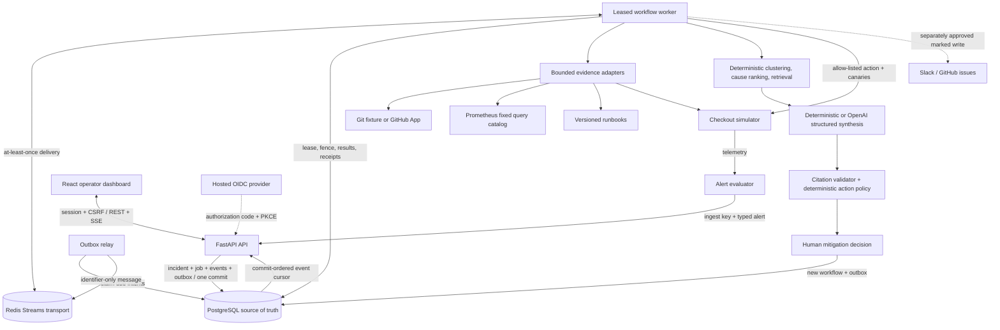

# PagerAgent architecture walkthrough

## Thirty-second explanation

PagerAgent is a multi-tenant incident-response control plane built around typed receipts. It stores
an alert and durable work intent in PostgreSQL, uses Redis Streams only to wake leased workers,
collects and hashes bounded evidence, ranks causes and runbooks deterministically, and lets an LLM
turn that packet into cited language. A separate deterministic policy derives the only executable
action. Human approval queues another durable workflow, and recovery telemetry decides whether the
incident is mitigated. Slack/GitHub communication and postmortem finalization have their own
authority records.

## Runtime flow

The solid center of the system is PostgreSQL. Redis can be unavailable, lose an entry, or deliver
twice without becoming the business source of truth.

## Release flow

```mermaid
flowchart LR
    PR["Pull request"] --> CI["Reusable quality gate"]
    TAG["Semantic release tag"] --> CI
    CI --> BUILD["Scanned multi-architecture non-root images"]
    BUILD --> GHCR["GHCR digests + SBOM"]
    GHCR --> ATTEST["OCI provenance attestations"]
    ATTEST --> RELEASE["Tagged release manifest + metadata"]
    RELEASE --> APPROVE["Protected environment approval"]
    APPROVE --> VERIFY["Verify release assets + both image attestations"]
    BOOTSTRAP["One-time cluster-admin Namespace bootstrap"] -.-> FOUNDATION
    VERIFY --> FOUNDATION["Namespace-scoped foundation + least-privilege Secret checks"]
    FOUNDATION --> MIGRATE["Compatibility-aware migration Job / exact backend digest"]
    MIGRATE -->|"complete"| ROLLOUT["API + worker + relay + dashboard rollout"]
    ROLLOUT --> READY["PostgreSQL + application-compatible schema readiness"]
```

The release workflow publishes but does not deploy. A separate protected workflow accepts a
release tag, verifies the release assets, derives the full OCI digest references from verified
release metadata, verifies both image attestations against the release workflow and source
revision, then materializes environment-specific non-secret values. Namespace creation is a one-time
cluster-admin bootstrap; ordinary promotion credentials stay namespace-scoped. The migration gate
runs before the workflow waits for every rollout, and release/runtime-secret revision annotations
force an observable restart when either boundary changes.

Migration `20260718_0013` introduces a singleton compatibility marker with
`minimum_application_generation=12`. Readiness accepts exactly one linear Alembic head whose marker
permits this application generation: its own head is `current`, while a future head is
`forward_compatible` only when the explicit minimum remains at most 12. Missing or higher markers
fail closed. The migration Job runs `python -m app.db.migrate`, so it upgrades older databases,
no-ops on an explicitly compatible current/future database, and rejects a future incompatible one.
This marker is the boundary where compatibility-aware rollback begins; older releases require
separate qualification. Database downgrade is never automatic.

## Why the pipeline is split this way

There are five different kinds of work that an “agent” implementation often mixes together:

| Concern | PagerAgent owner | Why it is separate |
| --- | --- | --- |
| Establish facts | Typed collectors, clusterer, rankers, retriever | Facts can be tested against scenario ground truth. |
| Explain facts | Structured synthesizer | Language can change without changing operational authority. |
| Decide what is executable | Deterministic action policy | A model cannot invent an action type, target, or parameter. |
| Authorize a write | Versioned human decision | Approval is attributable, replayable, and revocable by state. |
| Perform and verify the write | Leased worker and typed adapter | Retries, fencing, idempotency, and recovery checks are operational concerns. |

This is the core design claim: the model is useful, but it is deliberately downstream of evidence
and upstream of authority.

## End-to-end sequence

### 1. Identity becomes application authority

The local dashboard issues development sessions for four real RBAC roles: viewer, responder,
incident commander, and admin. Hosted mode instead uses a server-owned OIDC Authorization Code +
PKCE transaction:

1. `/auth/oidc/login` creates independent state, nonce, browser binding, and PKCE verifier.
2. PostgreSQL stores hashes plus an encrypted verifier and an expiry; the browser gets a temporary
   HttpOnly binding cookie.
3. The callback atomically consumes the transaction before contacting the fixed token endpoint.
4. PagerAgent verifies the identity token, resolves an exact issuer/subject membership, and creates
   a revocable database session.
5. Every authenticated request reloads the session and active membership. Cookie-authenticated
   writes additionally require the per-session CSRF token.

An internal JWT is therefore not sufficient by itself. Logout, organization switching, session
revocation, or membership deactivation takes effect through the database before token expiry. The
SSE endpoint repeats the authority check while the stream is open. The browser also advances a
request/authority epoch before switch, logout, or forced sign-out: responses from the prior epoch
cannot invoke auth handlers, replace the new tenant session, or commit its CSRF token.

Key code: `backend/app/api/routes/auth.py`, `backend/app/auth/oidc.py`,
`backend/app/auth/dependencies.py`, and `backend/app/memberships/service.py`.

### 2. Alert ingestion closes the first dual-write window

The alert evaluator uses a separate ingest key and a configured organization; it does not impersonate
a browser user. Alert fingerprinting deduplicates repeated deliveries. In one database transaction,
incident creation also stores:

- the incident and alert receipt;
- the initial incident event;
- an investigation workflow and idempotent job;
- ordered workflow events; and
- an outbox message containing the intent to publish the job.

If that transaction rolls back, none of the pieces survive. If it commits while Redis is down, all
of them survive.

Key code: `backend/app/services/incidents.py`, `backend/app/workflows/store.py`, and
`backend/app/db/models.py`.

### 3. The outbox and worker provide effectively-once domain effects

The outbox relay claims due PostgreSQL rows with `FOR UPDATE SKIP LOCKED`, publishes an
identifier-only message to a Redis Stream, and stores the exact stream ID as its receipt. A repair
scan checks whether an old saved ID still exists; it republishes only a missing nonterminal
delivery.

Workers use the stream as an at-least-once wake-up signal. Before a handler runs, the worker commits
an expiring database lease and attempt number. Long work heartbeats the lease. Every domain commit
checks a worker/attempt fencing token under lock, so a late worker cannot overwrite a successor.

Replay is absorbed at several layers:

- one deterministic workflow dedupe key per business trigger;
- one unique job idempotency key per step;
- unique investigation, proposal, execution, collaboration, and postmortem relationships;
- a proposal-scoped simulator mutation key; and
- provider-visible collaboration markers plus reconciliation.

Retryable errors schedule bounded exponential backoff in PostgreSQL. Permanent errors or exhausted
attempts produce a visible dead-letter state and a Redis DLQ message.

This is not distributed exactly-once delivery. It is at-least-once execution plus leases, fencing,
deduplication, and reconciliation that yield effectively-once domain effects.

Key code: `backend/app/workflows/dispatcher.py`, `backend/app/workflows/broker.py`,
`backend/app/workflows/engine.py`, and `backend/app/workflows/worker.py`.

### 4. Evidence is bounded, normalized, and immutable

The investigation worker gathers evidence outside long-held database locks, then verifies current
authority/revisions before committing artifacts and rankings.

The deterministic demo stores structured telemetry, failure clusters, a fixture commit catalog,
ranked commits, causal candidates, and runbook matches. Optional production-shaped adapters add:

- GitHub App installation evidence with a fixed API origin, bounded lookback and request budget,
  repository-scoped validation, signed webhook receipts, and connector/credential provenance; and
- Prometheus evidence selected by a server-owned query ID, fixed read endpoint, bounded time window,
  series/sample/label/byte limits, normalized output, and revision fencing.

Prometheus can add only a conservative corroboration bonus to an already-supported non-unknown
cause. It cannot establish root cause or authorize a write by itself. The current UI truthfully
marks backend-specific logs and traces as not collected.

Key code: `backend/app/services/investigations.py`, `backend/app/investigation/`,
`backend/app/services/github_evidence.py`, and `backend/app/services/prometheus_evidence.py`.

### 5. Synthesis cannot manufacture authority

The synthesis interface has a deterministic provider for tests/demos and an OpenAI Responses API
provider for structured generation. Both must return the same `GroundedBriefDraft`: four claim
types, evidence IDs, confidence, verification steps, and operator-facing text.

The citation validator rejects unknown evidence IDs and mismatches between a rendered claim and
its typed field. Then deterministic policy derives an `ActionEnvelope` from the top causal class,
confidence, and allow-listed runbook:

- a supported code regression can propose rollback to `stable-v1` for `checkout-api`;
- a supported configuration regression can propose disabling exactly the evidenced flag; and
- an upstream, missing, unknown, or low-confidence cause remains `escalate_only`.

Adding an executable capability requires a schema, policy branch, adapter, recovery test, and
evaluation case—not a prompt change.

Key code: `backend/app/copilot/synthesis.py`, `backend/app/copilot/citations.py`,
`backend/app/copilot/actions.py`, and `backend/app/domain/proposals.py`.

### 6. Approval, execution, and recovery are three receipts

The proposal starts as `pending_approval` or `advisory`. Approval is allowed only for a principal
with `mitigations.decide` while the incident is investigating. The transaction records the
append-only decision and queues a separate mitigation workflow before any action occurs.

The worker rechecks the typed envelope and executes only the supported simulator mutation. It then
sends 15 canaries, including the previously failing cohort. Only verified zero-failure recovery
changes the proposal to `verification_passed` and the incident to `mitigated`.

Key code: `backend/app/services/proposals.py`, `backend/app/copilot/execution.py`, and
`backend/app/copilot/actions.py`.

### 7. External communication has another authority boundary

A grounded proposal does not authorize PagerAgent to speak in Slack or create a GitHub issue. A
responder prepares server-built output from the immutable proposal. PagerAgent freezes the exact
payload hash, destination, connector revision, and credential revision. An incident commander then
approves or rejects that output separately.

Approval atomically creates the decision, delivery receipt, workflow, job, and outbox. Before a
write, the worker rechecks the frozen authority and searches a bounded provider window for the
stable output UUID. One exact prior marker becomes a reconciled receipt; contradictory matches or
an incomplete search fail closed; no match permits one marked write. Provider responses are reduced
to a normalized Slack timestamp or GitHub issue receipt.

Key code: `backend/app/services/collaboration.py`, `backend/app/connectors/slack.py`, and
`backend/app/connectors/github_issues.py`.

### 8. Resolution creates a controlled learning record

Verified recovery permits resolution. Resolution queues postmortem generation through the same
outbox/worker path. Narrative sections must cite incident evidence; the exact timeline comes from
database events. Draft edits use optimistic versions and create immutable revision snapshots with
an actor and change note. Finalization is explicit, attributed, and irreversible through the API.

Key code: `backend/app/services/postmortems.py`, `backend/app/copilot/postmortems.py`, and
`backend/app/api/routes/postmortems.py`.

## The receipt chain

| Receipt | What it proves | What it does not prove |
| --- | --- | --- |
| Auth session + membership | Current actor, organization, role, permissions, and expiry | That an action is appropriate for an incident |
| Alert + incident event | What crossed the threshold and when it was received | The root cause |
| Evidence artifact | Source, normalized payload, content hash, and collection provenance | That correlation is causation |
| Ranked cause/runbook | Deterministic score and explanation over available signals | That a model may execute anything |
| Grounded proposal | Cited human-readable claims and a policy-derived typed action | Human approval |
| Proposal decision | Who approved/rejected and when | That the external effect succeeded |
| Mitigation execution | Idempotency key, before/after telemetry, and canary result | Authorization to publish a message |
| Collaboration decision/delivery | Exact approved content/destination and normalized provider receipt | Distributed exactly-once delivery |
| Postmortem revision | Authored document version and evidence references | That edited prose was model-authored |

## Connector credential custody

Connector APIs are write-only for secrets: responses and audit events never echo credential
material. New or rotated credentials disable the connector until a live validation succeeds and an
admin explicitly enables the exact validated revision.

Local mode uses an AES-256-GCM envelope. Hosted mode uses envelope encryption with AWS KMS:

1. `GenerateDataKey` returns a plaintext data key and KMS ciphertext blob outside a DB transaction.
2. PagerAgent encrypts the typed credential with AES-GCM and immutable tenant/connector/revision
   context, then locks and compare-and-swaps the current authority before persisting.
3. A worker snapshots the envelope, ends the DB transaction, calls `Decrypt` for the exact key ARN
   and context, authenticates the payload, and rechecks current enabled/revision state.
4. The plaintext exists only long enough to build the provider adapter.

Transient KMS availability failures are retryable; integrity, context, or unknown-key failures are
not. Hosted configuration is designed for provider workload identity; the deployment requires a
provider overlay and PagerAgent does not store static AWS credentials.

Key code: `backend/app/connectors/vault.py`, `backend/app/connectors/kms.py`, and
`backend/app/connectors/runtime.py`.

## Multi-tenant and concurrency boundaries

- Domain rows carry organization ownership, and service queries filter by the authenticated
  organization. Cross-tenant object identifiers intentionally return not found.
- Composite foreign keys keep incident, proposal, collaboration, and workflow records within one
  tenant aggregate.
- Membership and connector updates require expected versions; stale writes return conflict.
- Organization locks serialize last-admin and authority-sensitive changes.
- Connector provider calls use snapshot/call/compare-and-swap so database locks are not held across
  network latency.
- Workflow jobs use leases plus commit-time fencing; optimistic entity versions solve a different
  problem and are not substitutes for worker fencing.
- Workflow events publish behind a transaction-scoped PostgreSQL gate so the global SSE cursor is
  visible in commit order.

## What each datastore owns

### PostgreSQL

Organizations, users, memberships, login transactions, revocable sessions, identity audits,
connector metadata and encrypted envelopes, webhook delivery receipts, incidents, evidence,
rankings, proposals, decisions, executions, collaboration outputs, postmortems, workflows, jobs,
events, and outbox receipts.

### Redis Streams

At-least-once job wake-ups, consumer-group pending state, and a dead-letter transport copy. It does
not own the canonical job status, payload authority, or domain result.

### Browser

The rendered operator view, a host-only HttpOnly session cookie in hosted mode, and a CSRF token
made available through the session response. It does not own identity, permissions, provider
tokens, connector credentials, action parameters, or collaboration text.

## Evaluation architecture

Three schema-versioned scenarios define simulation inputs, causal truth, expected runbook, affected
cohort, expected action, red herrings, adversarial cases, and thresholds. The benchmark runs the
same deterministic clusterer, causal ranker, runbook retriever, action policy, and citation
validator used by the application path.

The gates cover top-one cause, reciprocal runbook rank, impact and cohort accuracy, citation
coverage, action safety, automation decision, and adversarial resilience. Tests also exercise the
persisted services and workflow path. Fixture results are regression evidence, not an estimate of
real-world model accuracy.

Key code: `backend/app/evaluation/`, `backend/app/domain/evaluations.py`, and `scenarios/`.

## Honest current boundary

Implemented now:

- deterministic code/configuration/dependency scenarios and evaluation gates;
- incident, investigation, proposal, mitigation, collaboration, and postmortem domains;
- PostgreSQL outbox, Redis Streams, leases, fencing, retries, dead letters, and SSE replay;
- local personas plus hosted OIDC/PKCE, revocable sessions, RBAC, membership administration, and
  tenant isolation;
- write-only connectors, GitHub App evidence/webhooks, Prometheus metric snapshots, Slack/GitHub
  collaboration adapters, and local/KMS credential envelopes; and
- deterministic/OpenAI structured synthesis behind the same grounding and authority checks.

Not demonstrated by the stock deterministic recording:

- a real hosted IdP or AWS account;
- real Slack/GitHub provider writes without operator-supplied installations and permissions;
- production network policy, IAM, managed PostgreSQL/Redis, or external secret injection; and
- backend-specific log and trace evidence collection. OpenTelemetry creates request/worker spans,
  but a managed OTLP backend is not configured in the stock stack.

## Suggested five-minute code tour

1. `scenarios/checkout-validation-bug.yaml` — the versioned causal contract.
2. `backend/app/services/incidents.py` — atomic incident/workflow creation.
3. `backend/app/workflows/dispatcher.py` — outbox publication and missing-receipt repair.
4. `backend/app/workflows/engine.py` — lease, retry, fencing, and handler execution.
5. `backend/app/services/investigations.py` — evidence orchestration and revision locks.
6. `backend/app/copilot/actions.py` — generated prose ends; deterministic authority begins.
7. `backend/app/services/proposals.py` — approval and verified mitigation.
8. `backend/app/services/collaboration.py` — separate communication approval and frozen content.
9. `backend/app/auth/oidc.py` — hosted token verification and bounded provider interaction.
10. `backend/app/connectors/kms.py` — managed data-key envelope boundary.
11. `.github/workflows/release.yml` — scan, digest build, release assets, and image attestations.
12. `deploy/verify_release.py` — tag/revision/image/manifest binding before protected promotion.
